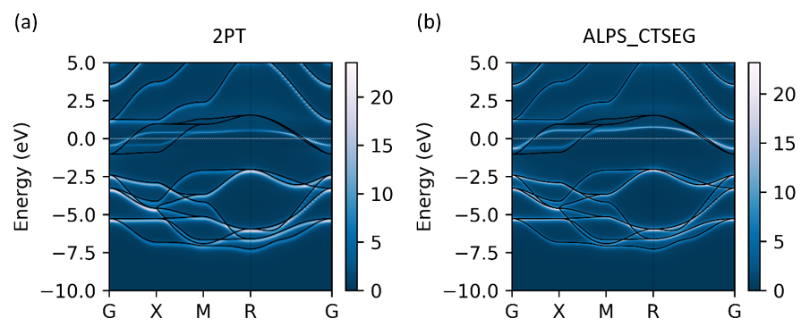

##### The software will be released soon. (Updated: 2018-10-19)
# DMFTpack
DMFTpack is the software for DFT+DMFT calculation. Various projection methods and the impurity solvers are available, e.g., iterative perturbation theory (IPT), self-consistent second-order perturbation theory (SC2PT), and CT-QMC. The interface connecting DFT package, e.g., OpenMX and impurity solvers is also provided.
##### Developer: [Jae-Hoon Sim](https://sites.google.com/site/jhsim4279/) (email: jh_sim@kaist.ac.kr , jhsim4279@gmail.com)


## Requirements
### Impurity solver 

* Hybridization expansion quantum Monte Carlo impurity solver:
  [To perform the CT-QMC solver, one of the following solvers should be installed: Otherwise, one can use the (SC) 2PT solver, which is implemented in the DMFTpack itself.]
  * Implemented in ALPS library
    [http://alps.comp-phys.org](http://alps.comp-phys.org)
  * Implemented by K. Haule at Rutgers University
    [http://www.physics.rutgers.edu/~haule/](http://www.physics.rutgers.edu/~haule/) (See also to install impurity solver: [link](http://hauleweb.rutgers.edu/tutorials/Tutorial0.html)) 

### Eigen (>=3.3)
* C++ template library for linear algebra: matrices, vectors, numerical solvers, and related algorithms. http://eigen.tuxfamily.org
* Since Eigen version 3.3 or later, you can use the BLAS / LAPACK or Intel MKL libraries.
  * Using BLAS/LAPACK from Eigen [http://eigen.tuxfamily.org/dox/TopicUsingBlasLapack.html](http://eigen.tuxfamily.org/dox/TopicUsingBlasLapack.html)
  * Using Intel® MKL from Eigen [http://eigen.tuxfamily.org/dox/TopicUsingIntelMKL.html](http://eigen.tuxfamily.org/dox/TopicUsingIntelMKL.html)

## Installation 

* Install pre-requirements. Note that the LAPACK or Intel MKL libraries are optional:

  ```ShellSession
  $ sudo apt-get install gcc g++
  $ sudo apt install openmpi-common openmpi-bin libopenmpi-dev
  $ sudo apt install make
  $ sudo apt-get install liblapack-dev
  ```


* Install Eigen library:

  ```ShellSession
  $ git clone https://github.com/eigenteam/eigen-git-mirror
  ```


* Install DMFTpack code:

  ```ShellSession
  $ git clone https://github.com/ElectronicStructureTheory-KAIST/DMFTinOpenMX_dev.git
  $ cd DMFTinOpenMX_dev/src
  $ vi makefie  (Replace the variables with ${} to the proper values for your system.)
  $ make all
  ```

* (Optional) Install MQEM to perform the analytic continuation:

  ```ShellSession
  $ git clone https://github.com/ElectronicStructureTheory-KAIST/MQEM.git
  ```

## Example
### Hubbard model

* Test calculation can be performed for single-band Hubbard model as following:

  ```ShellSession
  $ cd ../example/Hubb_model/primitive_Cell_ipt
  $ mpirun -np 4 ../../dmft | tee "std.out"
  $ gnuplot gw_loc_Im.gnuplot
  $ gnuplot sw_Im.gnuplot
  ```

* Now, one may want to do analytic continuation from the imaginary Green's function to the real-frequency spectral function.
  * Any continuation method can be used to obtain the density of states from the Green's function.
  * For the case of self-energy continuation, one may generate "realFreq_Sw.dat_i_j" file. Here i and j are orbital indices. Each file contains omega for the first column and real and imaginary part of the self-energy for the second and third column, respectively.
  * (optional) For the system with large spin-orbit coupling, we recommend MQEM method developed by J.-H. Sim [PRB (in press); arXiv:1804.01683]. The source code will be available soon via GitHub (update: 2018-10-19).

    ```ShellSession
    $ mkdir realFreqSpectrum; cd realFreqSpectrum
    $ mkdir continuation; cd continuation
    $ cp ../../Sw_SOLVER.full.dat  ./
    $ julia $(MQEM_dir)/src/mem.jl Sw_SOLVER.full.dat | tee "std.out"
    ```

    * mqem.input.toml file is generated, one can control parameters for MQEM continuation method as following (See https://github.com/KAIST-ELST/MQEM.jl for more details):

    * (key) = (variable)

* band structure: To do calculate band structure, SOLVER_TYPE=TB and RESTART>1 in input.pam is required, providing "realFreq_Sw.dat_i_j".

  ```ShellSession
  $ mkdir ../bandstruc; cd ../bandstruc
  $ cp  -r ../continuation/realFreq_Sw.dat_*  ../../Inputfiles/*  ../../Restart   ./
  $ vi input.parm
  $ mpirun -np 4 ../../../../dmft | tee "std.out"
  ```


* Now one can plot the band structure as following:
  ```ShellSession
  $ python qsband.plot.py
  ```


### SrVO3
* As same way, one can obtain band structure of the SrVO3 .
* For DFT+DMFT calculation, non-interacting Hamiltonian is written in "SYSTEM_NAME.scfout" file, which is the output of the OpenMX code. (In this example one can simply uncompress "SVO113.tar.xz" file)
* The figure below shows that the SrVO3 Band structure, calculated by two different impurity solvers, namely 2PT and ALPS_CTSEG.


## Document 

### list of parameters

four input files required for DMFT calculation.

* List of input files
  * "input.parm": the computational information is written here. See below for more details.
  * "input.solver": information for impurity solver, e.g., U, N_TAU, ...
  * "Hk.HWR" and "OverlapMatrix.HWR"(optional): non-interacting Hamiltonian is written in the "Hk.HWR" file. When the non-orthogonal basis is used, the overlap matrix should be provided. 
  * Alternatively, "Hk.HWR" and "OverlapMatrix.HWR" are replaced by "SYSTEM_NAME.scfout", which can be obtained from OpenMX code output.

* input.parm
  * Computational information:
    * SYSTEM_NAME
    * SOLVER_TYPE = {ALPS_CTSEG, RUTGERS_CTSET, RUTGERS_CTHYB, IPT, SC2PT, 2PT, TB}
    * SOLVER_DIR = path to impurity solver (default: ~/bin/)
    * SOLVER_EXE = executable impurity solver (default: hybridization)
    * MAX_DMFT_ITER ={1,2...}, maximum DMFT iteration (default: 20)
    * MIXING = (default: 0.8), self-energy mixing weight in the DMFT iteration
    * RESTART = {0,1,...}, for initial calculation, >0 to start self-energy obtained from previous calculation. (default: 0)
  * Lattice information
    * N_ATOMS = {1,2,..}, the number of atoms in the unit cell
    * N_CORRELATED_ATOMS = {1,2,...}, the number of atoms containing strong correlated orbitals.
    * N_ELECTRONS = {1,2,...} total number of the electrons in the unit cell.
    * MAGNETISM = {0,1,[2]} (default: 2)
    * K_POINTS = (nk1,nk2,nk3) k-grids to discretize the first Brillouin zone.
  * DFT+DMFT option
    * H0_FROM_OPENMX = {0,1}  = 1 if "SYSTEM_NAME".scfout file is exist. Otherwise, Hk.HWR file should b exist in the work folder with "H0_FROM_OPENMX"=0.
    * num_subshell = the number of nl subshell for each orbital, e.g., num_subshell=5 for s2p2d1 basis
    * rot_sym =  Quantum number l of the angular momentum for each subshell.
    * subshell = dimension of the subshell.
    * Rydberg_set = 0 for nominally occupied orbitals, 1 for empty
  * Projection method
    * MODEL_WINDOW_U = upper bound of the energy window for the correlated subspace. The correlated orbitals are projected into the model window (default: 10).
    * MODEL_WINDOW_D = lower bound of the energy window for the correlated subspace (default: -10)
    * DC_TYPE = {nominal, [fll]}, double counting method (default: fll)
    * N_d = {0,1,..}, nominal charge in the correlated orbitals
    * HARTREE_ATOMS = {1,2,...} Atom indices of the correlated atoms
    * HARTREE_ORBITALS_RANGE = the range of the correlated orbitals indices 
  * DOS & Band calculation
    * MODE = {band, qsband, dos, qsband}, specifies the band/dos calculation for non-interacting (or quasi-particle) dispersion
    * K_GRID_BAND = (default: 40)
    * SPECTRAL_ENERGY_GRID = (default: 1000)
    * N_K_PATH = the number of paths for the band calculation
    * K_PATH = this keword specifies the paths of the band dispersion
* input.solver
  * impurity_information
    * N_ORBITALS = the number of orbitals in impurity site
    * N_HARTREE_ORBITALS = the number of the correlated orbitals
    * U = intra-orbital interaction
    * U' = inter-orbital interaction
    * J = Hund's coupling
    * BETA = inverse temperature
  * Matsubara_frequency
    * N_MATSUBARA = the number of the Matsubara frequencies
    * N_TAU = mesh grids in the imaginary time axis
  * ALPS_CT_HYB_input
    * MEASURE_legendre = should be choose "1"
    * MEASURE_freq = should be choose "1"
    * TEXT_OUTPUT = should be choose "1"
    * MU_VECTOR  = should be set as  "mu_vector.alps.dat"
    * DELTA = should be set as  "delta_t.dat"
